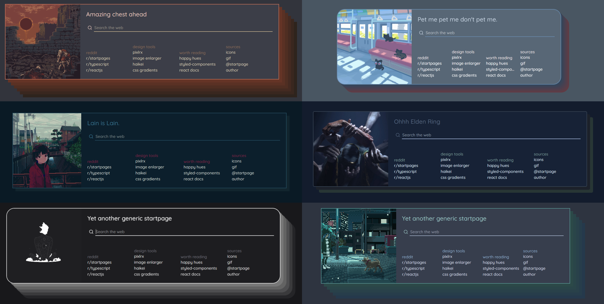

# Yet another generic startpage



A startpage with a generic layout and many settings to modify the appearance.

[Demo](https://prettycoffee.github.io/yet-another-generic-startpage/)

## Usage

There are several options for using this startpage.

### Fast setup

The easiest way to set it up is using the repositories demo with one of the many new tab override extensions like [this one for firefox](https://addons.mozilla.org/en-US/firefox/addon/new-tab-override/) or [this one for chrome](https://chrome.google.com/webstore/detail/new-tab-redirect/icpgjfneehieebagbmdbhnlpiopdcmna).

Install the extension and set `https://prettycoffee.github.io/yet-another-generic-startpage/` as new tab url.

### Local Setup with Mini Yags

You can extract your startpage design into static files for local use by downloading a `Mini-YAGS` version.

To create a `Mini-YAGS` copy:

1. Open the [Demo](https://prettycoffee.github.io/yet-another-generic-startpage/)
2. Click on the arrows in the top right corner
3. Design your startpage
4. Scroll down to the `Mini-YAGS` section and click on `Zip me a copy!`
5. Extract the files in the zip on your local system

To apply it for new tabs, install one of the the new tab override extensions and set `file:///C:/path/to/your/mini-yags/index.html` as new tab url.

### Github Pages with Mini Yags

Required Knowledge: `git`, `github`

You can host your `Mini Yags` copy with github pages as well, to have it online. To do that, create your `Mini Yags` copy as explained before.

Then follow these steps:

1. Create a repository
2. Push all the files of your `Mini Yags` copy into the repository, commit and push
3. Open the repository settings on Github
4. Open the `Pages` section from the navigation on the left hand side
5. Select for `Source` -> `Deploy from branch` and for `Branch` -> `master` (or `main`) and `/(root)`
6. Click on save

The startpage should now be hosted on github pages, it may take some minutes to finish the deployment. The url will be `<user-name>.github.io/<repo-name>`.

Note: This setup may change over time, if Github changes things, but the idea should stay the same.

### Full startpage (no Mini Yags)

Required Knowledge: `git`, `github`, `npm`, `node`

Instead of building a `Mini Yags` copy you can also host your own copy of the full startpage, including the settings window. This will allow you to customize the startpage later on.

To set it up with github pages:

1. Fork the repository in github
2. Clone it to your local machine
3. Run `npm i` and `npm run build` in the project directory
4. Deploy it on Github pages with one of the following methods:

   - Use the deploy script:
     1. Run `npm run deploy`, this will create a `gh-pages` and push the required files into the branch
     2. Select the `gh-pages` branch as the source branch in the `pages` settings
   - Make the setup manually:
     1. Copy the files from the `/build` directory into a new branch
     2. Push the branch to your repository
     3. Select the branch as the source branch in the `pages` settings

5. Use the github pages link (`<user-name>.github.io/<repo-name>`) in the browser extension.

### Others

There are several other options:

- `Docker`: If you are familiar with Docker, a `Dockerfile` and `docker-compose.yml` are included in the repo.

  ```
  # build
  $ docker build ./ -t yags

  # run
  $ docker run -d --name yags -p 8080:80 yags

  # Alternative: Compose
  $ docker compose up -d
  ```

- `Web extension`: You can set up the startpage as a web extension itself which would replace the installation of the extensions used above.
- `Local nginx server`: Set up a local nginx server

## Advanced: Modify code

If you want to modify something because the feature is missing, you can either create a `Mini Yags` copy and work with good old classic HTML/JS/CSS or you can fork the repo and change the `react` code.
